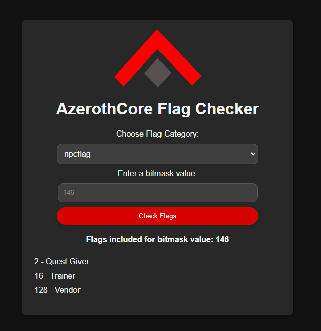

# AzerothCore Flag Checker

**AzerothCore Flag Checker** is a tool for easily checking various flags used in **AzerothCore**.

## [Live Demo](http://www.azerothcore.org/flag-checker/)

## Features

Currently supports

- npcflag
- unit_flags
- unit_flags2
- dynamicflags
- type_flags
- mechanic_immune_mask
- flags_extra
- spell_school_mask

## License

This project is licensed under the MIT License.

Created by **[Kitzunu](https://github.com/kitzunu)**.
